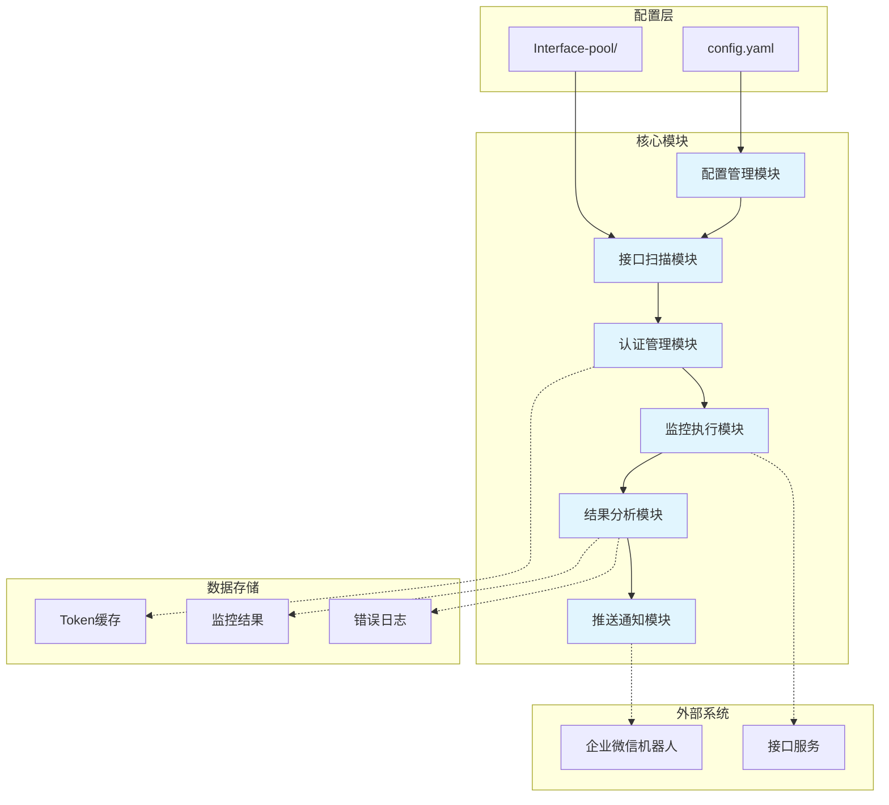

# 接口监控脚本技术实施Epic

## 1. 概述

本Epic旨在实现一个轻量级、易配置的接口监控自动化解决方案。系统将基于Python开发，通过定时任务机制自动扫描接口文档、执行接口连通性测试、监控异常状态，并在发现问题时通过企业微信机器人及时推送告警。

**核心技术方案：**
- **架构模式**：模块化架构，6大核心模块解耦设计
- **技术栈**：Python 3.x + requests + schedule + pyyaml
- **执行模式**：定时批量监控 + 并发执行
- **告警机制**：实时企业微信推送
- **性能目标**：支持1000+接口，P95响应时间<2秒

**范围覆盖：**
- 接口文档目录扫描与解析（JSON/YAML格式）
- Token认证管理（获取、缓存、自动刷新）
- 批量接口监控执行（15分钟间隔）
- 异常检测（500/404/503/超时/网络错误）
- 企业微信详细版报告推送

## 2. 架构决策

### 2.1 核心技术选择

**编程语言：Python 3.x**
- 理由：丰富的HTTP库生态，简洁的语法适合快速开发，良好的跨平台支持
- 替代方案考虑：Node.js（更快的I/O）、Go（更好的并发）

**HTTP客户端：requests库**
- 理由：最流行的Python HTTP库，API简洁友好，内置SSL验证和连接池
- 替代方案考虑：aiohttp（异步性能更好）、httpx（现代异步支持）

**定时任务：schedule库**
- 理由：轻量级，基于cron表达式，易于配置
- 替代方案考虑：APScheduler（更强大但复杂）、系统cron（不够灵活）

**配置管理：pyyaml**
- 理由：YAML格式可读性好，支持复杂数据结构
- 替代方案考虑：JSON（语法繁琐）、TOML（生态较小）

### 2.2 架构模式

**模块化分层架构**
- 决策：采用垂直切分的模块化设计，6大核心模块
- 理由：降低耦合度，便于维护和扩展，每个模块职责单一
- 权衡：增加模块间通信开销，但换取更好的可维护性

**生产者-消费者模式**
- 决策：监控执行模块作为生产者，结果分析作为消费者
- 理由：解耦监控和告警逻辑，支持异步处理
- 实现：使用队列或线程池传递结果

### 2.3 并发策略

**线程池并发模型**
- 决策：使用ThreadPoolExecutor，默认5个线程
- 理由：Python GIL限制下线程池适合I/O密集型任务，简单易用
- 替代方案：多进程（开销大）、异步编程（复杂度高）

### 2.4 错误处理策略

**重试机制**
- 决策：请求失败时自动重试3次，使用指数退避
- 理由：网络波动导致的临时失败可以通过重试恢复
- 配置：可配置重试次数和退避策略

**熔断器模式**
- 决策：连续失败的接口进入熔断状态，跳过监控
- 理由：避免无效请求浪费资源，快速定位持续故障
- 恢复：5分钟后自动恢复监控

## 3. 系统架构

**架构说明：**

**配置层：**
- config.yaml：主配置文件，包含监控间隔、超时、并发数、企业微信配置等
- Interface-pool/：接口文档根目录，按服务类型组织

**核心模块职责：**
- **配置管理模块**：加载YAML配置，验证配置项，动态更新配置
- **接口扫描模块**：递归扫描接口文档目录，解析JSON/YAML文件，提取接口信息
- **认证管理模块**：Token获取、缓存、检查过期、自动刷新
- **监控执行模块**：批量执行接口请求，并发控制，超时处理，重试机制
- **结果分析模块**：分类分析结果，识别异常状态，生成告警报告
- **推送通知模块**：格式化告警消息，调用企业微信Webhook，失败重试

**数据存储：**
- Token缓存：内存或文件存储，避免频繁获取
- 监控结果：短期存储，用于分析和统计
- 错误日志：持久化记录，便于问题排查

**外部系统交互：**
- 企业微信机器人：Webhook API推送告警消息
- 接口服务：HTTP/HTTPS接口连通性测试

## 4. 技术方案

### 4.1 前端组件（无）
本项目为纯后端监控脚本，无需前端界面。

### 4.2 后端服务

**接口文档管理（PRD ref: 2.1）**
- **目录扫描**：os.walk递归遍历Interface-pool目录，按服务类型分组
- **文件解析**：支持JSON和YAML两种格式，自动检测文件类型
- **数据提取**：统一提取接口名称、URL、方法、参数、Headers等信息
- **结构验证**：验证接口文档完整性和格式正确性
- **增量更新**：监控文档变更，只处理新增或修改的接口

**认证Token管理（PRD ref: 2.2.2）**
- **Token获取**：为每个服务调用Token获取接口，使用配置的认证信息
- **Token缓存**：内存字典缓存，键为服务名，值为Token及过期时间
- **过期检查**：每次请求前检查Token是否即将过期（剩余时间<5分钟）
- **自动刷新**：Token过期前自动调用接口获取新Token
- **并发安全**：使用线程锁确保并发场景下Token缓存的线程安全

**监控执行引擎（PRD ref: 2.2.1, 2.2.3）**
- **定时触发**：schedule库实现15分钟间隔的定时任务
- **批量执行**：按模块分组，同一模块内接口并发执行
- **并发控制**：ThreadPoolExecutor控制并发数量，默认5个线程
- **请求构造**：根据接口文档构造完整HTTP请求（URL、方法、参数、Headers）
- **超时处理**：配置超时时间（默认10秒），超时视为监控失败
- **重试机制**：失败请求自动重试3次，指数退避策略（1s, 2s, 4s）
- **异常分类**：
  - 500状态码 → 服务器内部错误
  - 404状态码 → 接口不存在
  - 503状态码 → 服务不可用
  - 超时 → 请求超时
  - 连接异常 → 网络错误、DNS解析失败等

**结果分析引擎（PRD ref: 2.3.2）**
- **状态分类**：将监控结果分为正常和异常两大类
- **异常聚合**：按错误类型和接口分组统计
- **报告生成**：
  - 问题接口列表（接口名称、URL、状态码）
  - 错误详情（请求内容、响应内容、错误原因）
  - 监控时间戳（开始时间、结束时间、耗时）
  - 统计信息（总接口数、正常数、异常数、成功率）
- **格式化**：生成Markdown格式的详细报告，便于阅读

### 4.3 基础设施

**部署架构**
- **运行方式**：Python脚本，可作为系统服务或定时任务运行
- **环境要求**：Python 3.7+，无外部依赖服务
- **配置文件**：config.yaml放置在脚本同目录，可外部挂载
- **日志管理**：日志输出到文件和控制台，支持日志轮转

**性能优化（PRD ref: 3.3）**
- **并发模型**：线程池 + 连接池复用，减少连接开销
- **内存控制**：结果数据及时清理，避免内存泄漏
- **响应时间**：P95 < 2秒目标，通过并发+缓存实现
- **资源占用**：内存 < 100MB，通过及时释放对象和控制缓存大小

**监控可观测性**
- **日志级别**：DEBUG、INFO、WARNING、ERROR四个级别
- **关键日志**：
  - 启动和配置加载
  - Token获取和刷新
  - 监控任务开始和结束
  - 异常接口详细信息
  - 推送结果（成功/失败）
- **性能指标**：监控任务耗时、成功率、异常分布等

**扩展性设计（PRD ref: 5.3）**
- **插件机制**：预留接口，未来可支持自定义监控逻辑插件
- **多环境**：配置文件中可设置不同环境的接口地址
- **通知扩展**：推送模块抽象化，未来可扩展邮件、短信等方式

## 5. 实施策略

### 5.1 开发阶段

**阶段1：环境搭建和基础模块开发**
- 搭建Python开发环境
- 安装依赖库（requests、schedule、pyyaml）
- 创建项目结构和目录
- 开发配置管理模块
- 开发日志系统

**阶段2：核心功能实现**
- 开发接口扫描模块（目录遍历+文档解析）
- 开发认证管理模块（Token获取+缓存）
- 开发监控执行引擎（HTTP请求+并发控制）
- 开发结果分析模块（异常检测+报告生成）

**阶段3：外部集成**
- 开发企业微信推送模块
- 实现Webhook调用和错误处理
- 集成所有模块，联调测试

**阶段4：优化和测试**
- 性能优化（并发参数调优）
- 错误处理完善（重试机制+熔断器）
- 单元测试编写
- 集成测试和压力测试

### 5.2 风险缓解

**技术风险**
- **接口变更风险**：建立接口文档版本管理机制，定期检查文档有效性
  - 缓解：增加文档变更检测，自动验证接口格式
- **Token过期风险**：实现Token过期前自动刷新机制
  - 缓解：预留5分钟缓冲时间，提前刷新
- **网络波动风险**：配置合理的重试和超时策略
  - 缓解：3次重试+指数退避，避免误报

**运营风险**
- **监控盲区**：建立接口文档完整性检查流程
  - 缓解：定期扫描接口文档目录，生成覆盖率报告
- **误报风险**：区分网络问题和服务问题，减少误报
  - 缓解：多次重试验证后才告警，区分临时和持续故障

### 5.3 测试策略

**单元测试**
- 配置管理：配置加载、验证、默认值
- 接口扫描：目录遍历、文件解析、格式验证
- 认证管理：Token获取、缓存、过期检查
- 监控执行：HTTP请求、超时处理、重试逻辑
- 结果分析：状态分类、异常聚合、报告生成
- 推送通知：消息格式化、Webhook调用

**集成测试**
- 端到端流程：配置加载 → 文档扫描 → 认证 → 监控 → 分析 → 推送
- 多服务场景：同时监控多个服务（user、nurse、admin）
- 并发场景：大量接口并发执行，验证性能
- 异常场景：模拟各种异常情况，验证告警准确性

**性能测试**
- 负载测试：1000+接口并发监控
- 压力测试：持续运行24小时，验证稳定性
- 资源测试：监控内存和CPU使用情况
- 响应时间：验证P95 < 2秒目标

## 6. 任务分解预览

### 阶段1：基础架构搭建（预计：8小时）
- [ ] 001 - 创建项目目录结构和配置文件
  - 建立Interface-pool目录结构示例
  - 创建config.yaml配置模板
  - 设置日志目录和文件
  - **PRD覆盖**：实现PRD 4.1配置文件需求
  - **工作量**：2小时

- [ ] 002 - 开发配置管理模块
  - 实现YAML配置文件加载
  - 配置项验证和默认值处理
  - 配置热更新机制
  - **PRD覆盖**：实现PRD 3.2.1配置管理模块
  - **工作量**：3小时

- [ ] 003 - 开发日志系统
  - 配置日志级别和格式
  - 实现文件和控制台双输出
  - 日志轮转机制
  - **PRD覆盖**：实现PRD 5.1.3日志记录需求
  - **工作量**：3小时

### 阶段2：核心监控模块（预计：16小时）
- [ ] 004 - 开发接口扫描模块
  - 目录递归扫描（os.walk）
  - JSON/YAML文件解析
  - 接口信息提取和验证
  - 增量更新机制
  - **PRD覆盖**：实现PRD 2.1接口文档管理
  - **工作量**：6小时

- [x] 005 - 开发认证管理模块
  - Token获取接口调用
  - Token内存缓存实现
  - 过期检查和自动刷新
  - 线程安全处理
  - **PRD覆盖**：实现PRD 2.2.2 Token认证管理
  - **工作量**：5小时

- [x] 006 - 开发监控执行引擎
  - HTTP请求构造和发送
  - 线程池并发控制
  - 超时处理机制
  - 重试逻辑实现
  - **PRD覆盖**：实现PRD 2.2.1监控执行和PRD 2.2.3异常检测
  - **工作量**：5小时

### 阶段3：分析和推送模块（预计：10小时）
- [ ] 007 - 开发结果分析模块
  - 监控结果分类和聚合
  - 异常状态识别（500/404/503/超时/网络错误）
  - 详细版报告生成（Markdown格式）
  - **PRD覆盖**：实现PRD 2.3.2推送内容需求
  - **工作量**：5小时

- [x] 008 - 开发企业微信推送模块
  - Webhook API调用封装
  - 消息格式化（Markdown）
  - @人员配置处理
  - 推送失败重试机制
  - **PRD覆盖**：实现PRD 2.3企业微信推送
  - **工作量**：5小时

### 阶段4：集成和优化（预计：8小时）
- [ ] 009 - 模块集成和调度器
  - 定时任务调度器（schedule库）
  - 15分钟间隔配置
  - 主流程编排和错误处理
  - **PRD覆盖**：实现PRD 2.2.1监控策略
  - **工作量**：4小时

- [ ] 010 - 性能优化和测试
  - 并发参数调优
  - 内存优化和泄漏检查
  - 单元测试编写（覆盖率>80%）
  - 集成测试和压力测试
  - **PRD覆盖**：实现PRD 3.3性能要求和PRD 7测试计划
  - **工作量**：4小时

**任务总计：10个任务，预计42小时工作量**

## 7. 依赖关系

### 7.1 外部服务依赖

**企业微信机器人**
- 依赖类型：Webhook API
- 协议：HTTPS POST
- 地址：https://qyapi.weixin.qq.com/cgi-bin/webhook/send
- 作用：推送监控告警消息
- SLA要求：可用性>99%，响应时间<2秒
- 风险：Webhook服务不可用时告警无法推送
- 缓解：本地缓存告警，服务恢复后补发

**接口服务**
- 依赖类型：目标监控接口
- 协议：HTTP/HTTPS
- 数量：取决于Interface-pool中的接口文档数量
- 作用：连通性测试和状态检查
- 风险：接口变更、认证信息过期、服务不可用
- 缓解：Token自动刷新、接口文档版本管理、重试机制

### 7.2 内部依赖

**配置管理**
- 依赖组件：config.yaml配置文件
- 依赖内容：监控间隔、超时时间、并发数、Webhook地址等
- 更新频率：配置变更时需重启服务
- 数据格式：YAML

**接口文档**
- 依赖组件：Interface-pool目录下的JSON/YAML文件
- 依赖内容：接口URL、方法、参数、Headers等
- 更新频率：接口变更时需更新文档
- 数据格式：JSON或YAML

### 7.3 技术依赖

**Python 3.7+运行环境**
- 系统要求：Linux/Windows/macOS
- 内存要求：最低100MB，推荐256MB
- 磁盘要求：1GB可用空间

**第三方库**
- requests：HTTP请求库
- schedule：定时任务库
- pyyaml：YAML解析库
- 安装方式：pip install -r requirements.txt

### 7.4 潜在阻塞

**配置获取**
- 阻塞风险：企业微信Webhook地址配置错误
- 影响：告警无法推送
- 解决：增加配置验证，启动时测试Webhook连通性

**权限问题**
- 阻塞风险：脚本无权限读取配置文件或写入日志
- 影响：服务启动失败
- 解决：提供安装脚本，自动设置权限

**网络连通**
- 阻塞风险：目标接口服务网络不可达
- 影响：误报接口故障
- 解决：增加网络连通性检查，区分网络和服务问题

## 8. 成功标准（技术）

### 8.1 功能性标准

**接口监控**
- [ ] 成功扫描Interface-pool目录下的所有JSON/YAML接口文档
- [ ] 正确解析并提取接口信息（URL、方法、参数、Headers等）
- [ ] Token获取和缓存机制正常工作，缓存命中率达到80%以上
- [ ] 15分钟间隔定时任务准确执行，误差不超过1分钟
- [ ] 并发执行监控任务，默认5个线程，无线程安全问题
- [ ] 正确识别500/404/503/超时/网络错误5类异常

**企业微信推送**
- [ ] 发现异常时立即推送，平均延迟<30秒
- [ ] 推送消息包含问题接口列表、错误详情、请求响应内容
- [ ] 支持配置@人员列表，推送时正确提及
- [ ] 推送失败时自动重试3次，成功率>95%
- [ ] 推送消息格式美观，Markdown渲染正确

### 8.2 性能标准（PRD ref: 3.3）

**并发性能**
- [ ] 支持1000+接口并发监控
- [ ] P95响应时间<2秒（单个接口请求时间）
- [ ] 100个接口监控完成时间<30秒
- [ ] 500个接口监控完成时间<2分钟
- [ ] 1000个接口监控完成时间<5分钟

**资源占用**
- [ ] 正常运行内存占用<100MB
- [ ] CPU使用率<50%（峰值期间）
- [ ] 无内存泄漏，持续运行24小时内存增长<10MB
- [ ] 磁盘占用<500MB（日志文件）

**可靠性**
- [ ] 服务连续运行无异常重启，7x24小时稳定性
- [ ] 监控任务成功率>95%（排除目标服务故障）
- [ ] 误报率<5%（网络波动导致的假故障）
- [ ] 告警推送成功率>98%

### 8.3 质量标准

**代码质量**
- [ ] 单元测试覆盖率>80%
- [ ] 代码通过pylint检查，分数>8.0
- [ ] 无已知严重Bug或安全漏洞
- [ ] 核心模块有详细注释和文档

**可维护性**
- [ ] 配置文件外置化，所有参数可配置
- [ ] 日志分级输出，关键操作有日志记录
- [ ] 错误信息清晰，便于问题排查
- [ ] 模块化设计，耦合度低，易于扩展

**兼容性**
- [ ] 支持Python 3.7+
- [ ] 支持Linux/Windows/macOS
- [ ] 支持JSON和YAML两种接口文档格式
- [ ] HTTP和HTTPS协议

### 8.4 验收标准

**功能验收**
- [ ] 演示完整监控流程：配置 → 扫描 → 认证 → 监控 → 分析 → 推送
- [ ] 验证异常场景：模拟500/404/503/超时，验证告警正确
- [ ] 验证多服务场景：同时监控user/nurse/admin三个服务
- [ ] 验证Token刷新：模拟Token过期，验证自动刷新

**性能验收**
- [ ] 压力测试：1000接口并发监控，性能指标达标
- [ ] 稳定性测试：连续运行24小时，无异常
- [ ] 资源测试：监控内存和CPU使用，达标

**交付验收**
- [ ] 提供完整Python源码
- [ ] 提供config.yaml配置模板
- [ ] 提供Interface-pool目录示例结构
- [ ] 提供requirements.txt依赖列表
- [ ] 提供README使用说明文档
- [ ] 提供安装部署脚本

---

**Epic创建时间**：2026-01-26T08:08:45Z
**预计工期**：2周（42小时工作量）
**Epic状态**：待开始