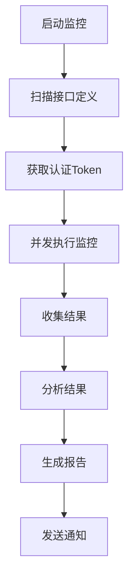

# 接口监控系统 - 操作说明

## 📋 目录
1. [项目概述](#1-项目概述)
2. [环境准备](#2-环境准备)
3. [配置文件说明](#3-配置文件说明)
4. [运行模式](#4-运行模式)
5. [监控功能详解](#5-监控功能详解)
6. [通知功能详解](#6-通知功能详解)
7. [故障排查](#7-故障排查)
8. [最佳实践](#8-最佳实践)

---

## 1. 项目概述

### 1.1 系统简介
接口监控系统是一个基于Python的自动化接口健康监控工具，支持：
- 🔄 **定时监控**：每15分钟自动检查接口状态
- 📊 **并发执行**：多线程并发监控，提高效率
- 📱 **智能通知**：企业微信推送，区分正常/异常报告
- 🎯 **精准告警**：仅对404/500错误发送异常告警
- 📈 **性能统计**：响应时间、成功率等详细统计

### 1.2 核心特性
- ✅ 支持多服务认证（user、nurse、admin）
- ✅ 支持Token自动刷新
- ✅ 支持HTTP/HTTPS接口
- ✅ 支持GET/POST等HTTP方法
- ✅ 详细的错误分类和统计

---

## 2. 环境准备

### 2.1 Python环境要求
- Python 3.8+
- 依赖包（使用pip安装）：
```bash
pip install schedule requests pyyaml dataclasses
```

### 2.2 目录结构
```
interface_monitoring/
├── src/                    # 源代码目录
│   ├── main.py            # 主调度程序
│   ├── config/             # 配置管理
│   ├── scanner/            # 接口扫描
│   ├── auth/               # 认证管理
│   ├── monitor/            # 监控引擎
│   ├── analyzer/           # 结果分析
│   └── notifier/           # 通知推送
├── Interface-pool/         # 接口定义目录
│   ├── user/              # 用户服务接口
│   ├── nurse/             # 护士服务接口
│   └── admin/             # 管理员服务接口
├── config.yaml            # 主配置文件
├── logs/                  # 日志目录
└── test_sequential_monitor.py  # 测试脚本
```

### 2.3 接口定义文件格式
每个接口需要定义一个JSON文件：
```json
{
  "name": "创建订单",
  "method": "POST",
  "url": "/api/v1/user/orders/create",
  "service": "user",
  "headers": {
    "Content-Type": "application/json"
  },
  "request_body": {
    "product_id": "123",
    "quantity": 1
  },
  "expected_status": 200,
  "timeout": 5
}
```

---

## 3. 配置文件说明

### 3.1 主配置文件 `config.yaml`

```yaml
# 监控配置
monitor:
  # 接口池目录
  interface_pool_path: "./Interface-pool"
  # 并发线程数（1-10）
  concurrent_threads: 5
  # 请求超时时间（秒）
  timeout: 3
  # 监控间隔（分钟）
  interval: 15

# 服务配置（认证信息）
services:
  user:
    auth_type: "http"
    token_url: "http://example.com/auth/token"
    auth_data:
      username: "user"
      password: "password"
  nurse:
    auth_type: "http"
    token_url: "http://example.com/auth/token"
    auth_data:
      username: "nurse"
      password: "password"
  admin:
    auth_type: "http"
    token_url: "https://example.com/admin/auth"
    auth_data:
      username: "admin"
      password: "password"

# 企业微信通知配置
wechat:
  enabled: true
  webhook_url: "https://qyapi.weixin.qq.com/cgi-bin/webhook/send?key=YOUR_KEY"
  at_users:
    - "zhangsan"
    - "lisi"
```

### 3.2 配置说明

| 配置项 | 类型 | 说明 | 示例值 |
|--------|------|------|--------|
| `monitor.interface_pool_path` | string | 接口定义文件目录 | "./Interface-pool" |
| `monitor.concurrent_threads` | int | 并发监控线程数（1-10） | 5 |
| `monitor.timeout` | int | HTTP请求超时时间（秒） | 3 |
| `monitor.interval` | int | 监控间隔（分钟） | 15 |
| `services.*.token_url` | string | Token获取URL | "http://..." |
| `services.*.auth_data` | object | 认证凭据 | {"username": "..."} |
| `wechat.enabled` | bool | 是否启用通知 | true |
| `wechat.webhook_url` | string | 企业微信Webhook地址 | "https://..." |
| `wechat.at_users` | array | @用户列表 | ["user1", "user2"] |

---

## 4. 运行模式

### 4.1 长期监控模式（推荐）

**适用场景**：生产环境、7x24小时监控

**启动命令**：
```bash
python src/main.py
```

**特性**：
- ✅ 自动定时执行（每15分钟）
- ✅ 并发监控（5个线程）
- ✅ 自动Token刷新
- ✅ 智能通知推送
- ✅ 支持优雅关闭（Ctrl+C）
- ✅ 自动日志记录

**运行示例**：
```
2026-01-28 14:08:03 - __main__ - INFO - 接口监控脚本启动
2026-01-28 14:08:03 - __main__ - INFO - 配置定时任务：每 15 分钟执行一次监控
2026-01-28 14:08:03 - __main__ - INFO - 立即执行一次监控周期...
2026-01-28 14:08:04 - __main__ - INFO - Step 1: 扫描接口文档...
2026-01-28 14:08:04 - __main__ - INFO - 发现 10 个接口
2026-01-28 14:08:04 - __main__ - INFO - Step 2: 获取认证Token...
2026-01-28 14:08:04 - __main__ - INFO - Step 3: 执行接口监控...
2026-01-28 14:08:04 - monitor.monitor_engine - INFO - 开始执行监控: 10个接口，5个并发线程
2026-01-28 14:08:05 - __main__ - INFO - Step 5: 发送监控报告...
2026-01-28 14:08:05 - __main__ - INFO - 监控报告发送成功
```

**停止监控**：
```bash
# 方法1: 在终端中按 Ctrl+C
# 方法2: 查找并结束进程
pkill -f "python src/main.py"
```

---

### 4.2 一次性测试模式

**适用场景**：调试、测试、验证配置

**启动命令**：
```bash
python test_sequential_monitor.py
```

**特性**：
- ✅ 顺序执行（单线程）
- ✅ 手动触发
- ✅ 详细日志输出
- ✅ 适合调试问题

**运行示例**：
```
2026-01-28 13:06:39 - __main__ - INFO - 开始执行监控（顺序执行）...
2026-01-28 13:06:39 - __main__ - INFO - 监控进度: 1/10 - Create
2026-01-28 13:06:39 - __main__ - INFO -  ✓ 成功 - 200 - 36.67ms
2026-01-28 13:06:39 - __main__ - INFO - 监控进度: 2/10 - Cancel
2026-01-28 13:06:39 - __main__ - INFO -  ✗ 失败 - 客户端错误 (HTTP 400)
...
2026-01-28 13:06:40 - __main__ - INFO - ============================================================
2026-01-28 13:06:40 - __main__ - INFO - 监控结果统计:
2026-01-28 13:06:40 - __main__ - INFO - 接口总数: 10
2026-01-28 13:06:40 - __main__ - INFO - 成功: 6
2026-01-28 13:06:40 - __main__ - INFO - 失败: 4
2026-01-28 13:06:40 - __main__ - INFO - 成功率: 60.00%
2026-01-28 13:06:40 - __main__ - INFO - ============================================================
```

---

## 5. 监控功能详解

### 5.1 监控流程



### 5.2 监控指标

| 指标 | 说明 | 计算方式 |
|------|------|----------|
| 接口总数 | 本次监控的接口数量 | 扫描到的接口数量 |
| 成功数 | HTTP状态码200的接口数 | 统计结果 |
| 失败数 | 非200状态码的接口数 | 统计结果 |
| 成功率 | 成功接口占比 | 成功数/总数×100% |
| 平均响应时间 | 所有接口响应时间平均值 | Σ响应时间/接口数 |
| 最慢接口 | 响应时间最长的接口 | 比较得出 |

### 5.3 错误分类

| 错误类型 | HTTP状态码 | 告警级别 | 处理方式 |
|----------|-----------|----------|----------|
| 正常 | 200 | ✅ 正常 | 无需处理 |
| 客户端错误 | 400 | ℹ️ 业务错误 | 记录但不告警 |
| 未授权 | 401 | ℹ️ 业务错误 | 记录但不告警 |
| 页面不存在 | 404 | 🚨 严重错误 | **发送告警** |
| 服务器错误 | 500 | 🚨 严重错误 | **发送告警** |
| 超时 | - | 🔶 网络错误 | 记录但不告警 |

---

## 6. 通知功能详解

### 6.1 通知逻辑

系统采用**双模式通知**：

#### 模式一：正常报告（无404/500错误）
```
✅ 接口监控正常

监控时间: 2026-01-28 14:08:03
接口总数: 10
运行时间: 1.25秒
最慢接口:
History
  URL: http://example.com/api/history (64.42ms)
```

#### 模式二：异常告警（有404/500错误）
```
🔔 接口监控告警

监控时间: 2026-01-28 14:23:03
总接口数: 10
运行时间: 1.31秒
最慢接口: History (64.42ms)

⚠️ 异常详情

### HTTP_404 (2个)
**History**
- URL: http://example.com/api/history
- 错误: 页面不存在 (HTTP 404)

### HTTP_500 (1个)
**Create**
- URL: http://example.com/api/create
- 错误: 服务器内部错误 (HTTP 500)
```

### 6.2 通知配置

**企业微信机器人设置**：

1. 在企业微信群中添加"自定义机器人"
2. 获取Webhook地址
3. 在`config.yaml`中配置：
```yaml
wechat:
  enabled: true
  webhook_url: "https://qyapi.weixin.qq.com/cgi-bin/webhook/send?key=YOUR_KEY"
  at_users:
    - "zhangsan"  # @张三
    - "lisi"      # @李四
```

### 6.3 @功能说明

- **支持@人员**：根据企业微信用户ID或手机号
- **自动@**：异常告警时自动@相关人员
- **正常报告**：默认不@人员（可配置）

---

## 7. 故障排查

### 7.1 常见问题

#### 问题1：Token获取失败
**症状**：日志显示"获取Token失败"
```
2026-01-28 14:08:04 - auth.providers.http_auth_provider - INFO - Token获取成功: service=user
```

**排查步骤**：
1. 检查`config.yaml`中的认证信息是否正确
2. 确认Token URL是否可以正常访问
3. 检查用户名/密码是否有效
4. 查看详细错误日志

**解决方案**：
- 更新认证凭据
- 检查网络连接
- 联系服务管理员

---

#### 问题2：接口监控超时
**症状**：部分接口响应超时
```
2026-01-28 14:08:05 - monitor.monitor_engine - ERROR - 监控超时: Create接口
```

**排查步骤**：
1. 检查接口响应时间是否超过配置的超时时间
2. 确认目标服务是否正常运行
3. 检查网络延迟

**解决方案**：
- 增加超时时间：`monitor.timeout: 10`
- 优化接口性能
- 检查网络环境

---

#### 问题3：企业微信通知失败
**症状**：日志显示"监控报告发送失败"
```
2026-01-28 14:08:05 - notifier.wechat_notifier - ERROR - 监控报告发送失败
```

**排查步骤**：
1. 确认Webhook地址是否正确
2. 检查机器人是否被禁用
3. 验证消息内容是否符合格式要求

**解决方案**：
- 重新获取Webhook地址
- 检查机器人状态
- 查看详细错误信息

---

#### 问题4：监控无结果
**症状**：扫描到0个接口
```
2026-01-28 14:08:03 - scanner.interface_scanner - WARNING - 未发现任何接口
```

**排查步骤**：
1. 确认`Interface-pool`目录是否存在
2. 检查目录权限
3. 验证接口定义文件格式

**解决方案**：
- 创建接口目录：`mkdir Interface-pool`
- 修复接口定义文件
- 检查文件权限：`chmod 755 Interface-pool`

---

### 7.2 日志分析

**日志文件位置**：
- 主日志：`logs/monitor.log`
- 实时日志：通过终端查看

**日志级别**：
- `INFO`：一般信息
- `WARNING`：警告信息
- `ERROR`：错误信息

**查看实时日志**：
```bash
# 方式1：直接运行，查看实时日志
python src/main.py

# 方式2：后台运行，查看日志文件
python src/main.py &
tail -f logs/monitor.log
```

**关键日志标识**：
- `Step 1`：扫描接口
- `Step 2`：获取Token
- `Step 3`：执行监控
- `Step 4`：分析结果
- `Step 5`：发送通知

---

## 8. 最佳实践

### 8.1 部署建议

#### 生产环境部署
```bash
# 1. 使用nohup后台运行
nohup python src/main.py > /var/log/interface-monitor.log 2>&1 &

# 2. 设置开机自启动
# 添加到/etc/rc.local
echo "python /path/to/src/main.py" >> /etc/rc.local

# 3. 使用systemd管理（推荐）
# 创建服务文件
sudo cat > /etc/systemd/system/interface-monitor.service << EOF
[Unit]
Description=Interface Monitor Service
After=network.target

[Service]
Type=simple
User=monitor
WorkingDirectory=/opt/interface-monitoring
ExecStart=/usr/bin/python src/main.py
Restart=always
RestartSec=10

[Install]
WantedBy=multi-user.target
EOF

# 启用服务
sudo systemctl enable interface-monitor
sudo systemctl start interface-monitor
```

#### 监控告警设置
```bash
# 设置日志监控，当出现ERROR时发送邮件
# 使用logwatch或自定义脚本
```

---

### 8.2 性能优化

#### 调整并发线程数
```yaml
monitor:
  concurrent_threads: 10  # 根据服务器性能调整
  timeout: 3             # 根据接口响应时间调整
```

**建议值**：
- 小型项目（< 50接口）：3-5线程
- 中型项目（50-100接口）：5-8线程
- 大型项目（> 100接口）：8-10线程

---

#### 调整监控间隔
```yaml
monitor:
  interval: 15  # 根据业务需求调整
```

**建议值**：
- 核心接口：5-10分钟
- 一般接口：15分钟
- 低频接口：30-60分钟

---

### 8.3 安全建议

#### 1. 配置文件安全
```bash
# 设置配置文件权限
chmod 600 config.yaml

# 不要将配置文件提交到Git
echo "config.yaml" >> .gitignore
```

#### 2. Token安全
- 使用环境变量存储敏感信息：
```yaml
services:
  user:
    auth_data:
      username: "${USER_USERNAME}"  # 从环境变量读取
      password: "${USER_PASSWORD}"
```

- 使用密钥管理服务（KMS、Vault等）

#### 3. 网络安全
- 使用HTTPS协议
- 配置防火墙规则
- 限制访问IP

---

### 8.4 维护建议

#### 定期任务
```bash
# 每日清理旧日志
0 2 * * * find /path/to/logs -name "*.log.*" -mtime +7 -delete

# 每周检查磁盘空间
0 3 * * 0 df -h | awk '$5 > 80 {print $0}' | mail -s "Disk Space Alert" admin@example.com

# 每月备份配置文件
0 4 1 * * cp config.yaml /backup/config-$(date +\%Y\%m).yaml
```

#### 监控指标
- 监控成功率
- 平均响应时间
- 错误分布
- 系统资源使用率

---

## 📞 技术支持

### 联系方式
- **项目地址**：Git仓库链接
- **问题反馈**：GitHub Issues
- **技术文档**：本操作说明

### 更新日志
- **v1.0.0** (2026-01-28)
  - 初始版本发布
  - 支持定时监控
  - 支持企业微信通知

---

**文档版本**：v1.0.0
**最后更新**：2026-01-28
**维护团队**：开发团队
